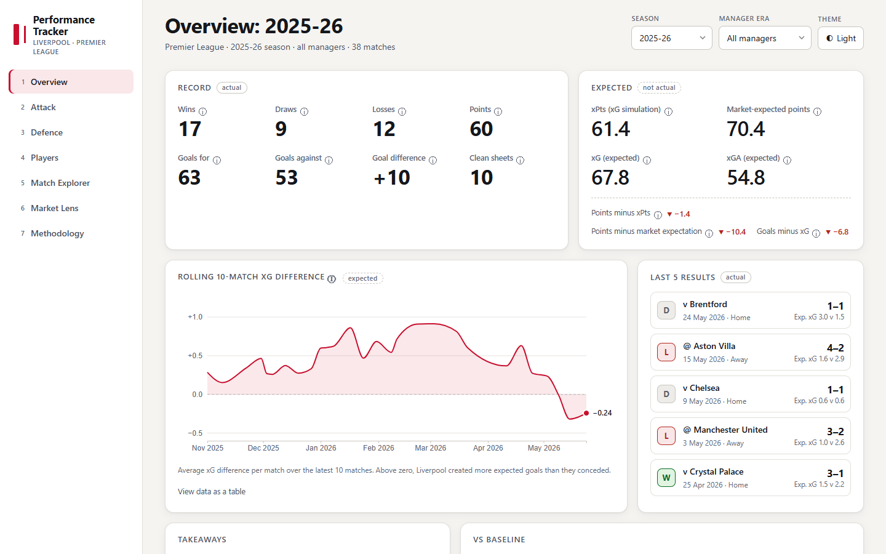
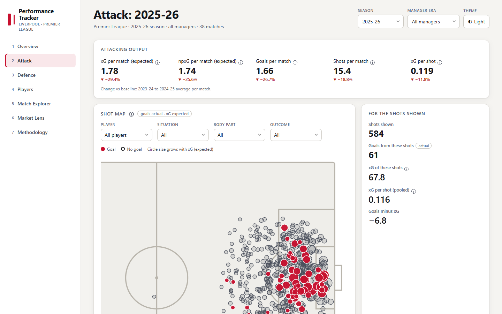
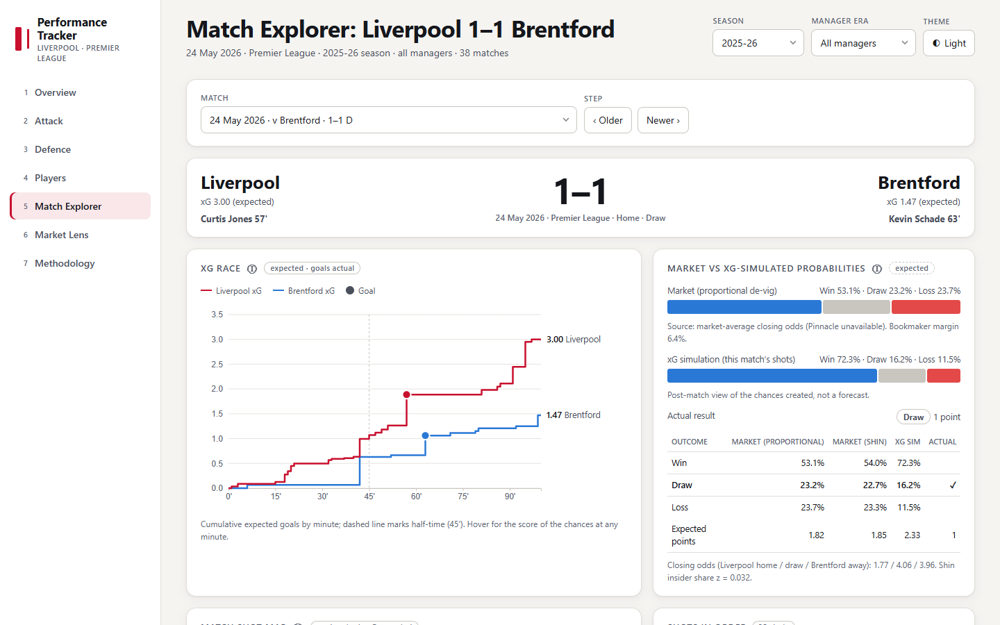
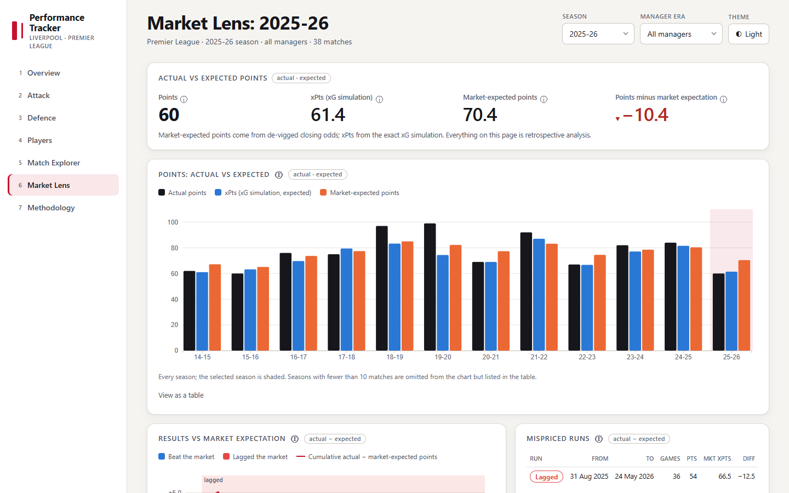
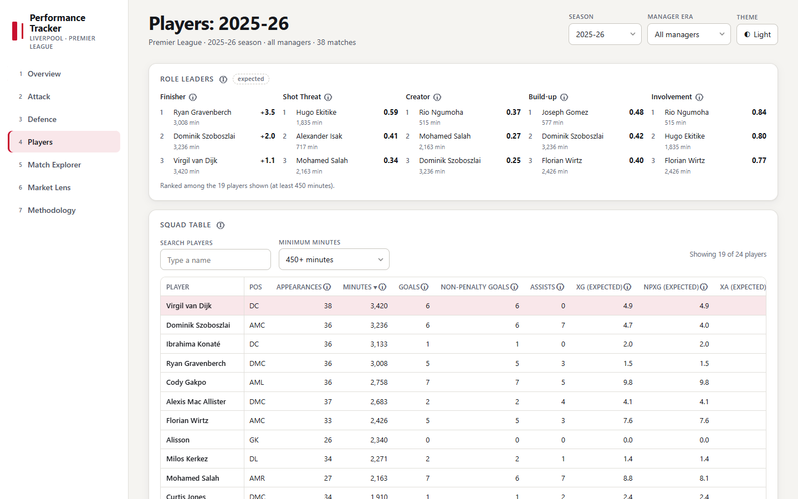
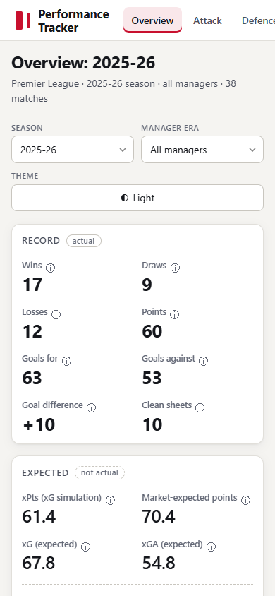
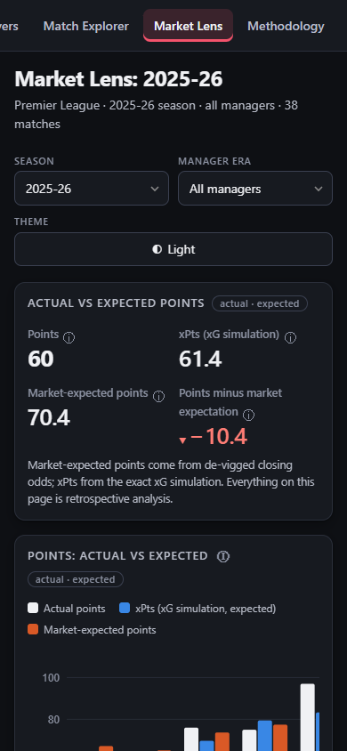

# Liverpool FC Performance Tracker

An interactive dashboard of Liverpool's Premier League performance since 2014/15, with a **market lens** that sets
betting-market expectations beside expected-goals (xG) performance and actual results. One self-contained HTML file,
no backend, no runtime API calls.

**Live site:** https://danny23delee.github.io/liverpool_tracker/ (deployed by GitHub Actions; refreshed every Tuesday)



## The problem

Football dashboards routinely show numbers that cannot be right: fractional "goals", a "−117%" change, an xGA that fell
coloured red, a season label left over from the last selection, a canned sentence that contradicts the chart. This
project treats those as **test cases**: accuracy is the headline feature, and every one of those failure modes has an
automated guard.

| Failure seen elsewhere | How it is prevented here |
|---|---|
| Fractional goals, points or W/D/L | Actuals come from results only and are integers; xG, xGA and xPts are always labelled "expected" and shown to one decimal. Tests check `W + D + L = matches`, `points = 3W + D` and integer types. |
| Impossible percentage changes ("−117%") | Percentages only for non-negative metrics with a positive baseline. Percentage-point differences for percentages/probabilities, plain differences for signed metrics (goal difference, "minus xG"). A "0%" is never shown for a missing baseline: it renders "N/A". Regression test: 13.3 vs 12.2 is +9.0%. |
| Inverted good/bad colouring | The arrow follows the sign of the change; the colour comes from `higher_is_better` in the metric registry (xGA down is a green ▼). Tested per metric. |
| Stale season labels | A browser test switches seasons on every page and fails if any other season label is visible (baselines and takeaways that cite other seasons are explicitly marked). |
| Canned text that contradicts the data | Takeaways are generated by rules with thresholds; every number in a sentence is re-computed from the data by the tests. A positive form claim is impossible below 7 points from the last five. If no rule fires, nothing is shown. |

## What it shows

Hash-routed pages with shareable state (`#/attack?season=2025-26&era=all`), a global season selector, a manager-era filter
(Rodgers / Klopp / Slot / Iraola) and light/dark themes. Every page title and subtitle is generated from the current
selection, and every metric has an ⓘ tooltip whose text comes from one registry file.

| Page | Contents |
|---|---|
| **Overview** | Record (actual) beside xPts, market-expected points and xG (expected), rolling 10-match xG difference, last five results, rule-based takeaways, and a vs-baseline panel that always names its baseline. |
| **Attack** | Shot map (player / situation / body part / outcome filters, circle size grows with xG), goals minus xG by player, threat source mix, shot volume vs quality against every league club, per-match xG trend. |
| **Defence** | Shots-conceded map, xGA trend against the league average, open-play vs set-piece xGA, PPDA, deep completions allowed, clean sheets. |
| **Players** | Searchable, sortable squad table with per-90 values and a minimum-minutes filter, role leaders (Finisher, Shot Threat, Creator, Build-up, Involvement), player profile with season-over-season trends, two-player comparison. |
| **Match Explorer** | Any match: scoreline and scorers, xG race chart, both teams' shot maps, de-vigged pre-match market probabilities next to the exact xG-simulated probabilities. |
| **Market Lens** | Actual vs xG-simulated vs market-expected points by season; calibration (Brier score, log loss, reliability plot); mispriced runs; a hypothetical flat 1-unit stake at closing odds, clearly labelled *retrospective analysis, not a strategy*; a hook for an external model. |
| **Methodology** | Generated from the metric registry and the code: sources, definitions, baseline logic, the xG simulation, de-vig methods with worked examples, known limitations. Sections are collapsible. |

<p>




</p>
<p>


</p>

## Data sources

- **[Understat](https://understat.com)** (EPL, 2014/15 to now): every shot with x/y coordinates, situation, shot type,
  result and xG; team match xG, xGA, PPDA and deep completions; player match statistics.
- **[football-data.co.uk](https://www.football-data.co.uk)** (`E0.csv` per season): results and odds. The market price is
  **Pinnacle closing**, falling back to the market-average close (then Betfair Exchange) where Pinnacle is missing; the
  source used is recorded for every match. Betfair Exchange columns are kept where present.

The two are joined on (date ±1 day, home team, away team) through a name-mapping file. **Every Liverpool match must join
exactly once and the scores must agree, or the build fails.** Responses are cached, requests are limited to one per
second, and completed seasons are never fetched twice. There are no runtime calls from the browser to either source.

## Methodology highlights

- **Baseline:** the mean of per-match rates over the previous two Premier League seasons, always named in the UI. The first
  season, and any multi-season selection, has none and shows N/A. Under 10 matches (or 450 minutes for a player) a
  "small sample" badge appears and significance-based takeaways switch off.
- **xG simulation:** each shot is an independent Bernoulli trial with p = its xG (penalties are ordinary shots; own goals
  are excluded). Each team's goal distribution is computed **exactly by convolution** (no Monte Carlo), giving P(W/D/L)
  and xPts. Season totals land within 0.7 points of Understat's own xPts in every season (the test allows 2.0).
- **De-vig:** proportional normalisation by default, and **Shin (1993)** implemented and shown alongside it. Market-expected
  points = 3·P(win) + P(draw) from de-vigged closing probabilities.
- **Calibration:** Brier score, log loss and a reliability plot for the market and the xG simulation next to a naive
  benchmark. The simulation sees the match's own shots, so it is presented as a description of the chances, not a rival
  forecast.
- **Mispriced runs:** any 10 consecutive matches whose actual points differ from market-expected points by at least 4.

Full write-up, with worked examples computed by the real code, is on the site's Methodology page.

## Data quirks found while building it

Recorded in [DATA_NOTES.md](DATA_NOTES.md) and surfaced on the Methodology page:

- Understat no longer embeds JSON in its pages; the data comes from XHR endpoints.
- **Three different xG totals exist for a season** (team match history, sum of shots, team season statistics). The
  team-statistics one counts opponent own goals as 1.0-xG "shots"; removing them reproduces Liverpool's shot sums
  exactly in all 13 seasons. Understat's team match xG is also lower than the sum of its own shots in 158 of 922
  team-matches (17%), by up to 0.88. The site uses the sum of shots everywhere so that maps, charts and totals reconcile.
- Pinnacle closing odds are missing for 17 Liverpool matches in 2025/26 and for all of 2026/27, hence the fallback chain.

## How accuracy is enforced

113 automated tests must pass before anything is deployed:

| Suite | Tests | What it checks |
|---|---|---|
| `tests/test_etl.py` | 14 | 38 matches per completed season; every match joins once to odds with an agreeing score; every club name maps; no duplicate ids; goals from shots + own goals equal the score in every match; player goals + own goals equal team goals per season; roster totals equal Understat's season table; corrected league shot figures equal Liverpool's shots; fetch retries and rate limiting. |
| `tests/test_metrics.py` | 34 | Hand-computed fixtures; change function (null, pp, colour); +9.0% regression; de-vig validity and Shin/proportional agreement; **convolution equals brute-force enumeration**; season xPts within 2.0 of Understat's; takeaway sentences vs the data. |
| `tests/test_build.py` | 12 | The payload against independent pandas sums: shots, player rows, source mixes, league context, market probabilities, calibration, P&L, methodology generation. |
| `tests/test_frontend.py` | 53 | A real browser: every page × every season with zero console errors; no stale season labels; displayed values equal the build data; **all 461 match pages recomputed independently** (xG, market probabilities, simulated probabilities); shot positions compared circle by circle with the source coordinates and the 105×68 pitch; squad table, roles, calibration, staking, mispriced runs against independent code; external-model hook end to end; collapsible methodology; loading, failure and empty states; touch targets, tooltips on touch, WCAG AA text contrast, no overflow from 390 to 1440 px, performance budgets. |

The build **fails rather than warns** on unmatched rows, and the deploy job only runs if every test passed, so the last good
site stays live when a source changes shape.

## Architecture

```
etl.py               fetch + cache + clean + join  -> data/processed/*.parquet
metrics.py           registry access, baselines, xG simulation, de-vig, market maths, takeaways
build.py             processed data -> dashboard JSON -> inlined into the template -> dist/index.html
metrics.json         the metric registry (labels, formats, tooltips, colouring): single source of truth
config/              eras.json (manager eras by date), teams.json (name mapping), settings.json
template/            index.html (vanilla JS + D3 v7 from cdnjs) and methodology.md
tests/               test_etl / test_metrics / test_build / test_frontend
data/external/       optional model_probs.csv (see below)
```

Vanilla JavaScript with a pinned D3 v7, no framework and no npm build. All numbers are computed once in Python and only
*formatted* in the browser. The whole site is one file of about 1.5 MB (about 380 KB gzipped); it boots in about a quarter
of a second and the slowest page draws in under half a second.

## Run it locally

```bash
python -m venv .venv && source .venv/bin/activate      # Windows: .venv\Scripts\activate
pip install -r requirements.txt
python -m playwright install chromium                   # only for the browser tests
python etl.py          # first run fetches ~750 files at 1 request/second (about 13 minutes), then it is cached
python build.py        # writes dist/index.html; open it in a browser
python -m pytest -q    # everything above (needs dist/ built first)
```

Python 3.11+ is the target; it was developed on 3.10 and CI runs 3.11. Behind a TLS-inspecting corporate proxy on Windows, `truststore` is installed
automatically and uses the OS certificate store while keeping verification on.

## Deployment

[`.github/workflows/deploy.yml`](.github/workflows/deploy.yml) runs weekly (Tuesday 06:00 UTC), on manual dispatch and on
pushes to `main`: **ETL → pipeline/metric/payload tests → build → browser tests → deploy to GitHub Pages**. If anything
fails, nothing is deployed. Raw responses are cached between runs, so after the first run only new matches are fetched.
To enable it: repository *Settings → Pages → Build and deployment → Source: GitHub Actions*.

## Plug in your own model

Save `data/external/model_probs.csv` with a match key and home/draw/away probabilities (format in
[data/external/README.md](data/external/README.md)) and rebuild. It is scored with the same Brier score and log loss as
the market and the xG simulation, on the Market Lens page.

## Limitations

- xG is Understat's model; it does not know about goalkeepers, or player quality beyond the shot itself.
- The market lens uses one price series and the flat-stake numbers are **retrospective analysis, not a strategy and not
  betting advice**: a season is about 38 bets, so results are dominated by luck.
- A single season is a small sample; the site flags samples under 10 matches and players under 450 minutes.
- FBref advanced statistics are no longer available, and there are no defensive event statistics (tackles, interceptions).

## Attribution

Shot-level and player data: [Understat](https://understat.com). Results and odds:
[football-data.co.uk](https://www.football-data.co.uk). Charts: [D3](https://d3js.org). This is an independent portfolio
project and is not affiliated with or endorsed by Liverpool FC, the Premier League, Understat or football-data.co.uk. No
club crests, player photos or other licensed imagery are used.

Code is released under the MIT licence (see [LICENSE](LICENSE)); the data belongs to its sources and is subject to their terms.
